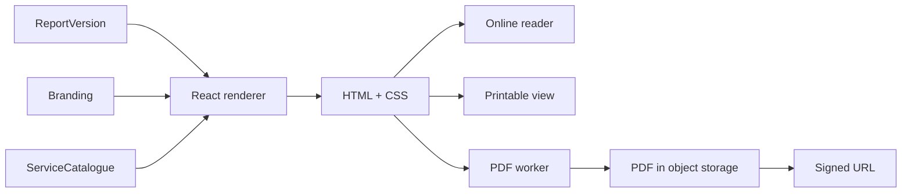

# Report Rendering

A WinterVell report is rendered server-side from a `ReportVersion` and the agency's branding configuration. The same source renders to three outputs: the interactive online reader, the printable view, and the PDF. This document describes the rendering pipeline, the share-link service, and the report-event tracking.

It is paired with [`../product/report-workflow.md`](../product/report-workflow.md) (product workflow), [`worker-architecture.md`](worker-architecture.md) (PDF worker), and [`storage-architecture.md`](storage-architecture.md) (asset storage).

---

## Rendering pipeline

The renderer is a single React component tree. The same tree is:

1. **Hydrated into the online reader** — the prospect opens the share link, the server renders the report HTML, the client hydrates it, and interactive features (expandable scores, evidence lightbox, CTA buttons) work.
2. **Rendered to a printable view** — a print-stylesheet is applied; the prospect's browser prints to PDF or paper.
3. **Rendered to PDF by the PDF worker** — a sandboxed Chromium renders the HTML to PDF with selectable text, page numbers, agency branding, and multi-page tables/screenshots. The PDF is uploaded to object storage and a signed URL is returned.

The single-source-of-truth renderer means the three outputs are always consistent. A change to the report's structure (a new section, a new chart) appears in all three outputs.

---

## Online reader

The online reader is a Next.js page at `/r/[token]`. The token is a `ReportShare.token`. The page:

1. Loads the `ReportShare` by token.
2. Validates: not revoked, not expired, view count under cap, password matches (if set).
3. Loads the `ReportVersion` and the agency branding.
4. Renders the report HTML.
5. Records a `ReportEvent` (view).
6. Returns the page to the prospect.

The reader is fully white-labelled — see [`../product/white-labelling-guide.md`](../product/white-labelling-guide.md). No WinterVell branding is visible.

Interactive features:

- Expandable scores (click to see the findings that contributed).
- Evidence lightbox (click a finding to see the screenshot and raw evidence).
- CTA buttons (book a call, download PDF, view proposal).
- Table of contents (sticky, scroll-spy).
- Print button (opens the printable view).

---

## PDF generation

PDF generation is performed by the PDF worker (see [`worker-architecture.md`](worker-architecture.md)). The worker:

1. Loads the `ReportVersion` and branding.
2. Renders the report to HTML using the same renderer as the online reader.
3. Opens a sandboxed Chromium instance.
4. Sets the page size (default A4; configurable), margins, header (agency logo + report title), footer (page number + agency URL + confidentiality notice).
5. Injects the agency's brand fonts (bundled locally; no web-font fetches).
6. Renders multi-page tables with repeating headers.
7. Renders screenshots at full resolution, scaled to fit the page width.
8. Saves the PDF to object storage.
9. Returns a signed URL.

The PDF has selectable text (it is not a rasterised image). Page numbers are in the footer. The agency logo is in the header. The confidentiality notice is in the footer. See [`../setup/pdf-configuration.md`](../setup/pdf-configuration.md).

---

## Share-link service

A `ReportShare` is the only way a prospect can view a report without logging in. Fields per [`../product/report-workflow.md`](../product/report-workflow.md):

- `token` — unpredictable, single-use-per-share, revocable.
- `reportVersionId` — the immutable `ReportVersion` this share exposes.
- `password` — optional, bcrypt-hashed.
- `expiresAt` — optional expiry.
- `maxViews` — optional view cap.
- `createdBy`, `createdAt`, `revokedAt`.

A share link is validated on every view:

- If `revokedAt` is set, return 404.
- If `expiresAt` is set and `now > expiresAt`, return 404.
- If `maxViews` is set and `viewCount >= maxViews`, return 404.
- If `password` is set and the request did not supply the correct password, return 401 with a password prompt.

A failed validation does not reveal whether the report exists. A revoked, expired, or over-cap share link returns the same 404 as a never-existed token.

---

## Report events

Each view generates a `ReportEvent`:

| Field | Purpose |
|---|---|
| `reportShareId` | The share link used |
| `eventType` | `view`, `cta_click`, `proposal_click`, `pdf_download` |
| `occurredAt` | Timestamp |
| `ipAddress` | Hashed; not the raw IP |
| `userAgent` | Truncated to browser + OS family; not the full UA string |
| `referrer` | Truncated to origin; not the full URL |

Privacy properties:

- IPs are hashed with a per-organisation salt; the raw IP is not stored.
- User agents are truncated to family (for example, "Chrome on macOS"); the full UA string is not stored.
- Referrers are truncated to origin; query strings are stripped.
- No third-party analytics scripts are loaded in the report reader.
- No tracking cookies are set.
- Events are scoped to the share link, not to a prospect identity.

The agency sees, per share link:

- `firstViewedAt` — set on the first view.
- `lastViewedAt` — updated on every view.
- `viewCount` — incremented on every view, capped at a sane maximum.
- `ctaClicks` — count of CTA clicks.
- `proposalClicks` — count of proposal-view clicks.

The agency does **not** see: the prospect's IP, the prospect's exact browser, the prospect's location, or a profile of the prospect's reading behaviour across reports. This is intentional. See [`../legal/SECURITY_DISCLOSURE.md`](../legal/SECURITY_DISCLOSURE.md) for the full privacy posture.

---

## Report versions and immutability

A `ReportVersion` is immutable once approved. Edits to findings, scores, or report configuration after approval create a new `ReportVersion`. The previous version remains accessible to organisation members (with a "superseded" badge) and to anyone holding a still-valid share link to it.

A share link points to exactly one `ReportVersion`. If the agency wants the prospect to see the new version, they create a new share link and send it. The old share link continues to point to the old version until it expires or is revoked. This prevents "the report changed between Monday and Friday" confusion.

---

## Branding injection

Branding is injected at render time from the agency's `Branding` record:

- Logo (light and dark variants) in the cover and header.
- Brand colours applied to the React component tree via CSS custom properties.
- Fonts (heading and body) loaded from bundled assets.
- Sender identity, terms URL, privacy URL, address, contact details in the agency-information section.
- Disclaimer text (rewordable, but the substantive claims are fixed — see [`../product/white-labelling-guide.md`](../product/white-labelling-guide.md)).

Branding is cached per-organisation. A branding change does not retroactively alter published `ReportVersion`s — they were rendered with the branding at publication time. New shares of the same version use the new branding (the renderer re-renders on each view), but the underlying findings and scores are immutable.

---

## Related documents

- [`../product/report-workflow.md`](../product/report-workflow.md) — product workflow
- [`worker-architecture.md`](worker-architecture.md) — PDF worker
- [`storage-architecture.md`](storage-architecture.md) — PDF and screenshot storage
- [`../setup/pdf-configuration.md`](../setup/pdf-configuration.md) — PDF configuration
- [`../product/white-labelling-guide.md`](../product/white-labelling-guide.md) — branding
- [`../legal/SECURITY_DISCLOSURE.md`](../legal/SECURITY_DISCLOSURE.md) — privacy posture
