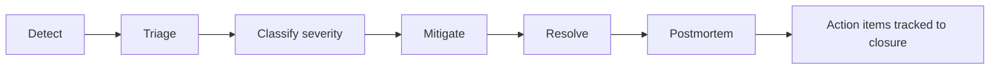

# Incident Response

This runbook describes how WinterVell incidents are classified, who responds, how communication works, and how postmortems are written. It is paired with the provider-outage and failure-specific runbooks linked below.

---

## Severity levels

| Severity | Definition | Examples | Response |
|---|---|---|---|
| **SEV-1** | Production outage or data-loss risk affecting all or most tenants | Database unreachable; object storage unavailable; SSRF bypass discovered; authentication broken | Page on-call immediately; status page updated; war room within 30 minutes |
| **SEV-2** | Major degradation affecting one or more tenants | Audit worker down; PDF worker down; AI provider down with no fallback; share-link service down | Page on-call within 30 minutes; status page updated if user-visible |
| **SEV-3** | Minor degradation or transient issue | Slow queries; intermittent 5xx; rate-limit false positives; single-tenant issue | On-call investigates during business hours; status page updated only if persistent |
| **SEV-4** | Cosmetic or low-impact issue | UI bug in non-critical flow; typo; analytics discrepancy | Triage in normal sprint flow |

---

## On-call

- A primary on-call engineer is reachable 24/7 for SEV-1 and SEV-2.
- A secondary on-call engineer is the escalation point if the primary does not respond within 15 minutes.
- On-call rotation is weekly, handoff on Monday morning.
- On-call is compensated per the agency's policy (out of scope for this document).
- The on-call engineer has runbook access, production access (via break-glass), and the authority to declare an incident.

---

## Incident lifecycle



### 1. Detect

Detection sources:

- **Synthetic monitoring** — automated checks on login, audit creation, report view, share-link validation.
- **Alerts** — error-rate, latency, queue-depth, worker-health, licence-validation alerts.
- **User reports** — support email, in-app feedback.
- **Provider notifications** — AI provider status page, email provider status page, database provider status page.

A detection is acknowledged within 15 minutes for SEV-1/2 (page) or 4 business hours for SEV-3/4 (ticket).

### 2. Triage

The on-call engineer:

- Confirms the issue is real (not a false alarm).
- Identifies the blast radius (one tenant, all tenants, one region, all regions).
- Classifies severity.
- Opens an incident channel (Slack/Teams/etc.).
- Appoints an incident commander (may be the on-call or a secondary responder).

### 3. Mitigate

The incident commander prioritises mitigation over root-cause. Mitigation options include:

- Roll back the last deployment.
- Disable a feature flag.
- Switch to a fallback provider (mock AI, queued email).
- Increase capacity (add worker processes).
- Rate-limit the abusive client.
- Take a non-critical service offline (for example, disable PDF generation if the PDF worker is the source of the issue).

Mitigation is logged in the incident channel with timestamps.

### 4. Resolve

Once mitigated, the incident commander confirms:

- The user-visible impact is gone.
- Monitoring has returned to baseline.
- No further action is required from on-call.

The incident is marked `resolved` in the incident channel. The status page is updated.

### 5. Postmortem

A postmortem is written for every SEV-1 and SEV-2 incident within 5 business days. The postmortem is blameless (focus on systems, not individuals) and follows the template below.

---

## Communication

### Internal

- **Incident channel** — created at triage. All discussion happens here.
- **Status updates** — every 30 minutes for SEV-1, every 2 hours for SEV-2, until resolved.
- **Stakeholder notification** — Owner/Administrator of affected tenants notified by email for SEV-1; for SEV-2 if user-visible.

### External

- **Status page** — `status.wintervell.example` (or per-deployment). Updated at triage, at mitigation, and at resolution.
- **Tenant notification** — for SEV-1, an email to all affected tenant Owners with: what happened, what data was affected (if any), what is being done, expected resolution time, and a contact for questions.
- **Public disclosure** — for security incidents (SEV-1 with data exposure), a public disclosure is made per [`../legal/SECURITY_DISCLOSURE.md`](../legal/SECURITY_DISCLOSURE.md) after the affected tenants have been notified.

---

## Postmortem template

```markdown
# Postmortem: <incident title>

**Date:** <YYYY-MM-DD>
**Severity:** SEV-<n>
**Incident commander:** <name>
**Time to detect:** <duration>
**Time to mitigate:** <duration>
**Time to resolve:** <duration>
**User impact:** <description and tenant count>

## Summary

<1-2 paragraph summary>

## Timeline

- <time> — <event>
- <time> — <event>

## Root cause

<technical root cause, not blame>

## Contributing factors

<factors that made the incident worse or longer>

## What went well

<things that worked>

## What went poorly

<things that did not work>

## Action items

- [ ] <action> — owner: <name> — due: <date>
- [ ] <action> — owner: <name> — due: <date>
```

Action items are tracked to closure in the project tracker. A postmortem without tracked action items is incomplete.

---

## Security incident specifics

For security incidents (suspected or confirmed unauthorised access, data exposure, vulnerability exploitation):

1. **Contain** — revoke suspect sessions, rotate suspect credentials, isolate affected systems.
2. **Preserve evidence** — capture logs, database snapshots, object-storage access logs before they expire.
3. **Notify** — the WinterVell security contact and the affected tenants' Owners.
4. **Assess** — determine what data was exposed, to whom, for how long.
5. **Disclose** — per [`../legal/SECURITY_DISCLOSURE.md`](../legal/SECURITY_DISCLOSURE.md), disclose to affected tenants within 72 hours of confirmation.
6. **Remediate** — fix the vulnerability, verify the fix, deploy.
7. **Postmortem** — within 5 business days, including a security-specific section.

---

## Related documents

- [`provider-outage.md`](provider-outage.md) — provider outage runbook
- [`audit-job-failure.md`](audit-job-failure.md) — audit job failure runbook
- [`ai-provider-failure.md`](ai-provider-failure.md) — AI provider failure runbook
- [`pdf-generation-failure.md`](pdf-generation-failure.md) — PDF generation failure runbook
- [`licence-server-failure.md`](licence-server-failure.md) — licence server failure runbook
- [`../legal/SECURITY_DISCLOSURE.md`](../legal/SECURITY_DISCLOSURE.md) — security disclosure policy
