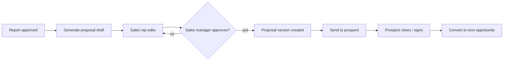

# Proposal Workflow

A WinterVell proposal is the commercial artifact an agency sends to a prospect after the prospect has engaged with the audit report. It is a structured scope of work with editable text in every field. This document lists the proposal fields, the workflow from approved findings to a sent proposal, and the rules that govern what the proposal may and may not contain.

It is paired with [`report-workflow.md`](report-workflow.md) (which produces the audit the proposal is based on) and [`pipeline-workflow.md`](pipeline-workflow.md) (which tracks the proposal as an opportunity).

---

## Workflow

### 1. Report approved

A proposal can only be generated from an approved `ReportVersion` — see [`report-workflow.md`](report-workflow.md). The findings, scores, and suggested services in the approved report are the source of truth.

### 2. Generate proposal draft

WinterVell generates a draft proposal by:

- Pulling the suggested services linked to findings in the report.
- Pulling default pricing from the agency's ServiceCatalogue.
- Pulling default phases from the report's 30/60/90 plan.
- Pulling default terms, validity, and disclaimers from the agency's branding configuration — see [`white-labelling-guide.md`](white-labelling-guide.md).

Every field in the draft is editable. Generation is a starting point, not a final output.

### 3. Sales representative edits

The Sales representative reviews the draft and edits:

- Scope, deliverables, exclusions.
- Pricing and payment schedule.
- Timeline and phases.
- Optional services and upsells.
- Client responsibilities and assumptions.

The Sales representative cannot send the proposal. Sending requires Sales manager approval.

### 4. Sales manager approval

The Sales manager reviews and either approves or returns the proposal for revision. Approval creates an immutable `ProposalVersion`. Subsequent edits require a new version.

### 5. Send

The proposal is sent via the configured email integration — see [`../setup/email-integration.md`](../setup/email-integration.md). The prospect receives a link to a branded proposal viewer. The pipeline stage moves to **Proposal sent**.

### 6. Prospect views / signs

The prospect views the proposal, accepts or requests changes. Acceptance is recorded with a timestamp, an IP, and a user-agent string. Signature is captured via a typed-name + checkbox confirmation (legally lightweight; agencies in regulated jurisdictions should attach a separate signed contract).

### 7. Convert to won opportunity

On acceptance, the opportunity moves to **Won** — see [`pipeline-workflow.md`](pipeline-workflow.md).

---

## Proposal fields

| Field | Description |
|---|---|
| `client` | Prospect name and contact |
| `title` | Proposal title |
| `executiveSummary` | 1–2 paragraphs, derived from the report's executive summary and editable |
| `currentState` | Summary of the prospect's current state, derived from the audit's findings |
| `objectives` | What the engagement is intended to achieve |
| `scope` | What is in scope |
| `deliverables` | Concrete deliverables, each linked to a finding or service where applicable |
| `exclusions` | What is explicitly out of scope (prevents scope creep) |
| `assumptions` | Assumptions the proposal depends on (access, content, third-party cooperation) |
| `dependencies` | External dependencies (hosting access, analytics access, content supply) |
| `clientResponsibilities` | What the client must provide or do |
| `phases` | Phased plan with start/end, deliverables, owner, dependencies |
| `timeline` | Overall timeline with milestones |
| `pricing` | Line items with quantity, unit price, total; currency per agency config |
| `optionalServices` | Upsells, each optional and independently priced |
| `paymentSchedule` | Milestone-based or time-based payment schedule |
| `acceptanceCriteria` | How "done" is defined for each deliverable |
| `changeControl` | How scope changes are handled after signature |
| `validity` | Date until which the proposal is valid |
| `signatures` | Client signature and agency signature, with timestamps |
| `nextStep` | A single, clear next step after acceptance |

Every text field is editable. Default text is generated from the audit and from the agency's branding configuration, but the Sales representative can rewrite any field. Nothing in the proposal is locked.

---

## Rules

### No legal guarantees without explicit approval

A WinterVell proposal **does not** contain:

- Guaranteed ranking improvements.
- Guaranteed revenue uplift.
- Guaranteed conversion-rate improvements.
- Guaranteed WCAG conformance.
- Guaranteed AI-answer-engine inclusion.
- Any "or your money back" language.

A proposal **may** contain:

- Indicative expected outcomes, clearly labelled as expectations, not guarantees.
- References to past client results, with the past client's permission and with the result clearly attributed to a specific engagement.
- A performance commitment tied to a measurable, agreed metric (for example, "we will implement all P1 findings within 60 days of signature"), provided the commitment is within the agency's control.

Any text that goes further than this requires **explicit approval** by the Sales manager at approval time. The approval is recorded in the audit log. See [`../architecture/security-model.md`](../architecture/security-model.md) for audit-log integrity.

### All text editable

No field is read-only. The Sales representative can rewrite the executive summary, change the pricing model, remove a phase, add an exclusion. The proposal is the agency's commercial document; WinterVell is the tool that produced the draft.

### White-labelled

Proposals are fully white-labelled: agency name, logo, colours, fonts, sender identity, reply-to, terms URL, privacy URL, custom domain. The prospect never sees WinterVell branding. The administrative area retains WinterVell attribution per the purchased tier — see [`../legal/COMMERCIAL_LICENSE.md`](../legal/COMMERCIAL_LICENSE.md) and [`white-labelling-guide.md`](white-labelling-guide.md).

### Pricing is indicative until the proposal is signed

Pricing shown in the report's "optional pricing" section is always labelled "indicative; subject to proposal." Pricing in the proposal itself is the agency's commercial offer. The two are not the same document and should not be treated as interchangeable.

---

## Proposal versions

A `ProposalVersion` is an immutable snapshot of the proposal at approval time. Edits after approval create a new version. The prospect always sees the latest approved version (or, if a specific version was sent, the version that was sent). Version history is visible to organisation members.

---

## Related documents

- [`report-workflow.md`](report-workflow.md) — what produces the audit the proposal is based on
- [`pipeline-workflow.md`](pipeline-workflow.md) — opportunity tracking
- [`white-labelling-guide.md`](white-labelling-guide.md) — agency branding
- [`../setup/email-integration.md`](../setup/email-integration.md) — sending the proposal
- [`../legal/COMMERCIAL_LICENSE.md`](../legal/COMMERCIAL_LICENSE.md) — commercial licence tiers
