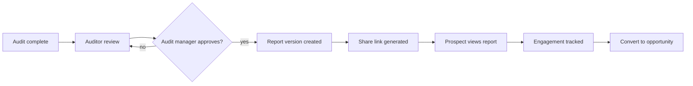

# Report Workflow

The WinterVell report is the client-facing artifact an agency sends to a prospect after an audit. This document describes the workflow from audit completion to published, shareable report, the report's sections, and the sharing options.

It is paired with [`proposal-workflow.md`](proposal-workflow.md) (which turns approved findings into a proposal) and [`../architecture/report-rendering.md`](../architecture/report-rendering.md) (which describes the rendering pipeline).

---

## Workflow

### 1. Audit complete

The audit engine has finished all runners (or has marked failed runners as incomplete per [`scoring-methodology.md`](scoring-methodology.md)). Findings are stored with full evidence. The audit is in the **Audit review** pipeline stage.

### 2. Auditor review

An Auditor reviews each finding:

- Confirms severity.
- Edits the human-readable explanation, business consequence, recommended action, estimated effort, and suggested service.
- Marks false positives (excluded from the client report, retained for audit history).
- Adds manual findings where applicable.
- Marks findings as verified.

The Auditor cannot publish. Publication requires an Audit manager — see [`user-roles.md`](user-roles.md).

### 3. Audit manager approval

The Audit manager reviews the prepared report. They can:

- Re-open specific findings for the Auditor to revise.
- Approve the report for publication.

Approval creates an immutable `ReportVersion` — a snapshot of the findings, scores, and report configuration at approval time. Subsequent edits to findings do not silently change a published report; they require a new `ReportVersion`.

### 4. Share

The Sales representative (or Audit manager) generates a share link and sends the report. The pipeline stage moves to **Report sent**, then to **Report viewed** when the prospect opens it.

### 5. Engagement tracking

Report views are tracked in a privacy-conscious way — see [`../architecture/report-rendering.md`](../architecture/report-rendering.md) and the share-link service below. The agency sees first-viewed, last-viewed, view count, and CTA clicks. The prospect is not profiled beyond what is needed to surface these signals.

### 6. Convert to opportunity

When the prospect engages, the Sales representative converts the prospect into an opportunity in the pipeline — see [`pipeline-workflow.md`](pipeline-workflow.md).

---

## Report sections

Every published report contains, in order:

1. **Cover** — agency branding (logo, colours, fonts), prospect name, audit date, report version. See [`white-labelling-guide.md`](white-labelling-guide.md).
2. **Executive summary** — 1–2 paragraphs written by the Auditor: what was audited, the headline score, the top three issues, and the top three opportunities.
3. **Overall score** — the Overall number from [`scoring-methodology.md`](scoring-methodology.md), with the score-version badge and the "not an industry certification" disclaimer.
4. **Category scores** — the nine sub-scores in a table with expand-to-explain.
5. **Priority issues** — Critical and High findings, sorted by severity then by category.
6. **Evidence** — per finding: URL, selector, screenshot (where collected), raw evidence, timestamp, tool/provider. Evidence is the contract between the agency and the prospect.
7. **Business impact** — qualitative, written by the Auditor. No fabricated revenue projections.
8. **Recommendations** — recommended action per finding, linked to suggested services where applicable.
9. **Quick wins** — Low-effort, High-impact findings. Sorted by effort-to-impact ratio.
10. **30 / 60 / 90-day plan** — staged recommendations: 30 days = critical fixes, 60 days = structural improvements, 90 days = strategic initiatives.
11. **Strategic opportunities** — things the prospect could do that are not strictly fixes (new content, new service line, new market).
12. **Suggested services** — links to the agency's ServiceCatalogueItems that map to the findings. See [`proposal-workflow.md`](proposal-workflow.md).
13. **Phases** — a phased implementation plan with dependencies, complexity, priority, expected impact.
14. **Optional pricing** — if the agency has enabled pricing in the report, indicative pricing per service. Always labelled "indicative; subject to proposal."
15. **Agency information** — agency name, contact details, website, social profiles.
16. **Call to action** — a single, clear next step ("Book a 30-minute call").
17. **Contact** — name, email, phone, calendar link.
18. **Disclaimer** — the canonical WinterVell disclaimer: automated findings are indicative, no WCAG certification, no ranking guarantee, not legal advice. See [`known-limitations.md`](known-limitations.md).

---

## Share-link service

A share link is a tokenised URL of the form `https://reports.<agency-domain>/r/<token>`. Each share link records:

| Field | Purpose |
|---|---|
| `token` | Unpredictable, single-use-per-share, revocable |
| `reportVersionId` | The immutable ReportVersion this share exposes |
| `password` | Optional bcrypt-hashed password |
| `expiresAt` | Optional expiry timestamp |
| `maxViews` | Optional view cap |
| `createdBy` | The user who created the share |
| `createdAt` | Creation timestamp |
| `revokedAt` | Revocation timestamp, if revoked |

A share link is the only way a prospect can view a report without logging in. Direct navigation to a report URL without a valid, unexpired, unrevoked token returns 404.

---

## Sharing options

| Option | Description |
|---|---|
| **Online (interactive)** | The default. The prospect opens the share link and reads the report in a branded reader. Expandable scores, evidence lightbox, CTA buttons. |
| **Secure link** | The base share-link with a token. |
| **Password-protected** | Share link with a required password. |
| **Expiring** | Share link with an `expiresAt`. After expiry, the link 404s. |
| **PDF download** | The prospect downloads a server-rendered PDF (selectable text, page numbers, agency branding). See [`../architecture/report-rendering.md`](../architecture/report-rendering.md). |
| **Printable** | A print-optimised view of the online report. |
| **Agency-branded** | Logo, colours, fonts, sender identity per [`white-labelling-guide.md`](white-labelling-guide.md). |
| **White-labelled** | No WinterVell attribution visible to the prospect. The administrative area retains WinterVell attribution per tier — see [`../legal/COMMERCIAL_LICENSE.md`](../legal/COMMERCIAL_LICENSE.md). |
| **Public preview** | An optional public, non-tokenised preview of the cover and executive summary only. Findings and evidence are never in public preview. |
| **Internal** | A share link restricted to organisation members. Used for internal review before publishing. |

---

## Report events

Each view generates a `ReportEvent` record:

- `firstViewedAt` — set on the first view of a share link.
- `lastViewedAt` — updated on every view.
- `viewCount` — incremented on every view, capped at a sane maximum to avoid inflating.
- `ctaClicks` — recorded when the prospect clicks a CTA in the report.
- `proposalClicks` — recorded when the prospect clicks through to a proposal.

Events are scoped to the share link, not to a prospect identity. WinterVell does not fingerprint the prospect's browser, does not set tracking cookies, and does not share event data with third-party analytics. See [`../architecture/report-rendering.md`](../architecture/report-rendering.md).

---

## Report versions and immutability

A published `ReportVersion` is immutable. Edits to findings, scores, or report configuration after publication require a new `ReportVersion`. The previous version remains accessible to organisation members (with a "superseded" badge) and to anyone holding a still-valid share link to it.

This means a prospect who received a report on Monday and is told on Friday "we found an additional issue" can be sent a new share link to a new `ReportVersion`. The original is not silently edited.

---

## Related documents

- [`audit-methodology.md`](audit-methodology.md) — what produces the findings
- [`scoring-methodology.md`](scoring-methodology.md) — what produces the scores
- [`proposal-workflow.md`](proposal-workflow.md) — findings to proposal
- [`white-labelling-guide.md`](white-labelling-guide.md) — agency branding
- [`../architecture/report-rendering.md`](../architecture/report-rendering.md) — rendering pipeline
- [`../architecture/storage-architecture.md`](../architecture/storage-architecture.md) — screenshot and PDF storage
